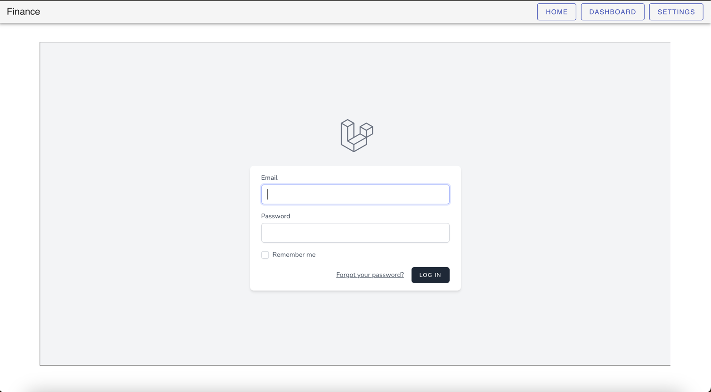

# Finance-front

> An electron-vue project for _finance-api_

## Description

Finance-front удобный вывод графиков для ваших финансов

___

### Screenshots

Home


Dashbord


Settings



## Build Setup

``` bash
# install dependencies
npm install

# serve with hot reload at localhost:9080
npm run dev

# build electron application for production
npm run build


# lint all JS/Vue component files in `src/`
npm run lint

```

---

This project was generated with [electron-vue](https://github.com/SimulatedGREG/electron-vue)
using [vue-cli](https://github.com/vuejs/vue-cli). Documentation about the original structure can be
found [here](https://simulatedgreg.gitbooks.io/electron-vue/content/index.html).
